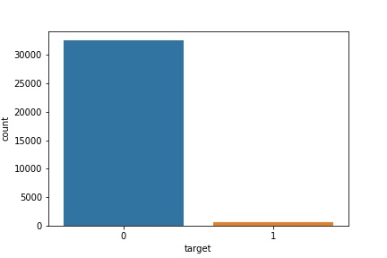
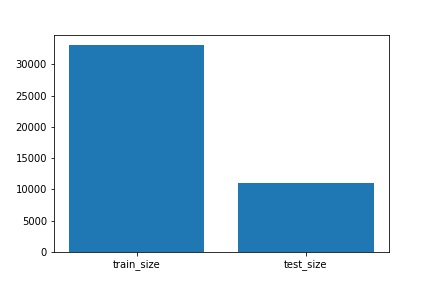
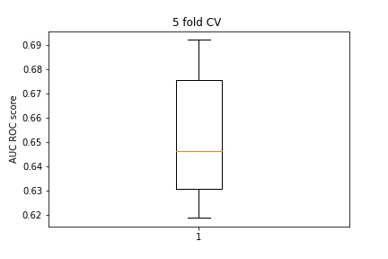

## Can we detect melanoma using lesion images

https://www.kaggle.com/c/siim-isic-melanoma-classification/overview/description

## Data Exploration

**Important Findings** 

* **We can clearly observe groups of images with similar statistics that depend on the image shapes!!!**
* **There is one group of the test images that is missing in train(1080 rows 1920 columns)! This would mean a complete new type of images that may lead to notable differences in CV scores and LB!**
* For most of the patients there were only a few images recorded (range from 1 to 20).
* 5% of the patients show more than 45 images. There is an extreme outlier in the test data with roughly 250 images!
* We have more males than females in both train and test data. For the test set this imbalance is even higher!
* We can observe **more older patients in test than in train**! The age is normally distributed in train but shows multiple modes in test.
* The distributions of image locations look very similar for train and test.
* We have highly imbalanced target classes!
* Multiple images does not mean that there are multiple ages involved! 
* We can observe a high surplus of males in the ages 45 to 50 and 70, 75 in train and test but in test we can find **even more males of high age > 75**.
* We have more malignant cases of higher age than benign cases.
* 62 % of the malignant cases belong to males and only 38 % to females! **We have to be very careful!!! As we have a surpus of males with ages above 70 and 75 it's unclear if the sex is really an important feature for having melanoma or not.** It could also be that the age is most important and that we only have more malignant cases for males due to their higher age! 

source : https://www.kaggle.com/mahmudds/siim-isic-melanoma-classification

1. Highly imbalanced dataset.

2. Train - Test size

## Baseline

### Only using tabular features in the dataset.

|    | image_name   | patient_id   | sex    |   age_approx | anatom_site_general_challenge   | diagnosis   | benign_malignant   |   target |
|---:|:-------------|:-------------|:-------|-------------:|:--------------------------------|:------------|:-------------------|---------:|
|  0 | ISIC_2637011 | IP_7279968   | male   |           45 | head/neck                       | unknown     | benign             |        0 |
|  1 | ISIC_0015719 | IP_3075186   | female |           45 | upper extremity                 | unknown     | benign             |        0 |
|  2 | ISIC_0052212 | IP_2842074   | female |           50 | lower extremity                 | nevus       | benign             |        0 |
|  3 | ISIC_0068279 | IP_6890425   | female |           45 | head/neck                       | unknown     | benign             |        0 |
|  4 | ISIC_0074268 | IP_8723313   | female |           55 | upper extremity                 | unknown     | benign             |        0 |

> 5-fold-cv with tabular features:

Model | Approach | val-AUCROC score
:------:|:----------:|:-----------------:
Resnet18 | 224x224,    no data augmentation,    no meta data used | 0.72 

